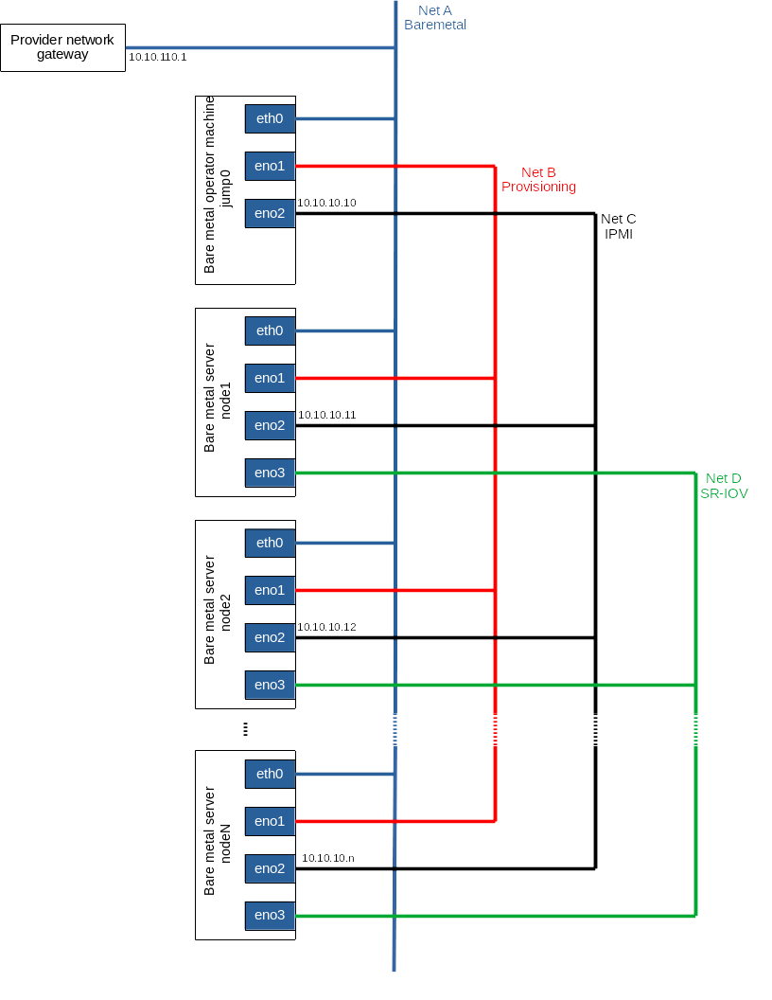
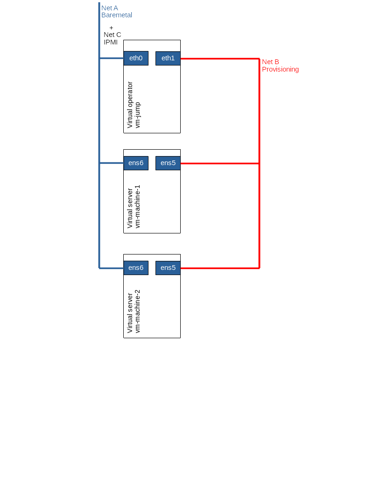
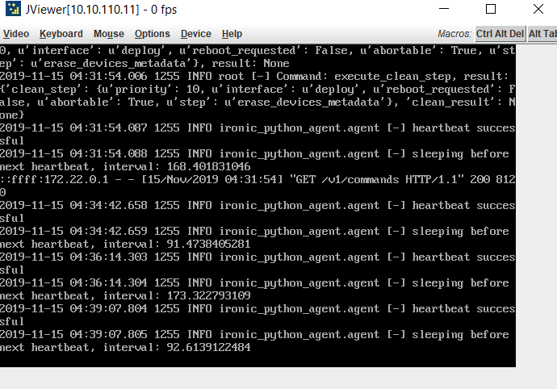

# Introduction
ICN strives to automate the process of installing the local cluster
controller to the greatest degree possible – "zero touch
installation". Most of the work is done simply by booting up the jump
server (Local Controller). Once booted, the controller is fully
provisioned and begins to inspect and provision the bare metal
servers, until the cluster is entirely configured. This document shows
step-by-step how to configure the network and deployment architecture
for the ICN blueprint.

# License
Apache license v2.0

# Deployment Architecture
The Local Controller is provisioned with the Metal3 Baremetal Operator
and Ironic, which enable provisioning of bare metal servers. The
controller has three network connections to the bare metal servers:
network A connects bare metal servers, network B is a private network
used for provisioning the bare metal servers and network C is the IPMI
network, used for control during provisioning. In addition, the
bare metal servers connect to the network D, the SRIOV network.

*Figure 1: Deployment Architecture*

- Net A -- Bare metal network, lab networking for ssh. It is used as
  the control plane for k8s, used by OVN and Flannel for the overlay
  networking.
- Net B (internal network) -- Provisioning network used by Ironic to
  do inspection.
- Net C (internal network) -- IPMI LAN to do IPMI protocol for the OS
  provisioning. The NICs support IPMI. The IP address should be
  statically assigned via the IPMI tool or other means.
- Net D (internal network) -- Data plane network for the Akraino
  application. Using the SR-IOV networking and fiber cables.  Intel
  25GB and 40GB FLV NICs.

In some deployment models, you can combine Net C and Net A to be the
same networks, but the developer should take care of IP address
management between Net A and IPMI address of the server.

Also note that the IPMI NIC may share the same RJ-45 jack with another
one of the NICs.

# Pre-installation Requirements
There are two main components in ICN Infra Local Controller - Local
Controller and k8s compute cluster.

### Local Controller
The Local Controller will reside in the jump server to run the Metal3
operator, Binary Provisioning Agent (BPA) operator and BPA REST API
controller.

### k8s Compute Cluster
The k8s compute cluster will actually run the workloads and is
installed on bare metal servers.

## Hardware Requirements

### Minimum Hardware Requirement
All-in-one VM based deployment requires servers with at least 32 GB
RAM and 32 CPUs.

### Recommended Hardware Requirements
Recommended hardware requirements are servers with 64GB Memory, 32
CPUs and SRIOV network cards.

## Software Prerequisites
The jump server is required to be pre-installed with Ubuntu 18.04.

## Database Prerequisites
No prerequisites for ICN blueprint.

## Other Installation Requirements

### Jump Server Requirements

#### Jump Server Hardware Requirements
- Local Controller: at least three network interfaces.
- Bare metal servers: four network interfaces, including one IPMI interface.
- Four or more hubs, with cabling, to connect four networks.

(Tested as below)
Hostname | CPU Model | Memory | Storage | 1GbE: NIC#, VLAN, (Connected extreme 480 switch) | 10GbE: NIC# VLAN, Network (Connected with IZ1 switch)
---------|-----------|--------|---------|--------------------------------------------------|------------------------------------------------------
jump0 | Intel 2xE5-2699 | 64GB | 3TB (Sata)<br/>180 (SSD) | eth0: VLAN 110<br/>eno1: VLAN 110<br/>eno2: VLAN 111 | eno3: VLAN 112

#### Jump Server Software Requirements
ICN supports Ubuntu 18.04. The ICN blueprint installs all required
software during `make install`.

### Network Requirements
Please refer to figure 1 for all the network requirements of the ICN
blueprint.

Please make sure you have 3 distinguished networks - Net A, Net B and
Net C as mentioned in figure 1. Local Controller uses the Net B and
Net C to provision the bare metal servers to do the OS provisioning.

### Bare Metal Server Requirements

### k8s Compute Cluster

#### Compute Server Hardware Requirements
(Tested as below)
Hostname | CPU Model | Memory | Storage | 1GbE: NIC#, VLAN, (Connected extreme 480 switch) | 10GbE: NIC# VLAN, Network (Connected with IZ1 switch)
---------|-----------|--------|---------|--------------------------------------------------|------------------------------------------------------
node1 | Intel 2xE5-2699 | 64GB | 3TB (Sata)<br/>180 (SSD) | eth0: VLAN 110<br/>eno1: VLAN 110<br/>eno2: VLAN 111 | eno3: VLAN 112<br/>eno4: VLAN 113
node2 | Intel 2xE5-2699 | 64GB | 3TB (Sata)<br/>180 (SSD) | eth0: VLAN 110<br/>eno1: VLAN 110<br/>eno2: VLAN 111 | eno3: VLAN 112<br/>eno4: VLAN 113
node3 | Intel 2xE5-2699 | 64GB | 3TB (Sata)<br/>180 (SSD) | eth0: VLAN 110<br/>eno1: VLAN 110<br/>eno2: VLAN 111 | eno3: VLAN 112<br/>eno4: VLAN 113

#### Compute Server Software Requirements
The Local Controller will install all the software in compute servers
from the OS to the software required to bring up the k8s cluster.

### Execution Requirements (Bare Metal Only)
The ICN blueprint checks all the precondition and execution
requirements for bare metal.

# Installation High-Level Overview
Installation is two-step process and everything starts with one
command `make install`.
- Installation of the Local Controller.
- Installation of compute cluster.

## Bare Metal Deployment Guide

### Install Bare Metal Jump Server

#### Creating a Node Inventory File

##### Preconfiguration for the Local Controller in Jump Server
The user is required to provide the IPMI information of the servers
they connect to the Local Controller by editing node JSON sample file
in the directory icn/deploy/metal3/scripts/nodes.json.sample as
below. This example only shows 2 servers. If you want to increase
servers, just add another array.

`node.json.sample`
``` json
{
  "nodes": [{
    "name": "node1",
    "ipmi_driver_info": {
      "username": "admin",
      "password": "admin",
      "address": "10.10.10.11"
    },
    "os": {
      "image_name": "bionic-server-cloudimg-amd64.img",
      "username": "ubuntu",
      "password": "mypasswd"
    }
  },
  {
    "name": "node2",
    "ipmi_driver_info": {
      "username": "admin",
      "password": "admin",
      "address": "10.10.10.12"
    },
    "os": {
      "image_name": "bionic-server-cloudimg-amd64.img",
      "username": "ubuntu",
      "password": "mypasswd"
    }
  }]
}
```

##### Local Controller Metal3 Configuration Reference
- *node*: The array of nodes required to add to Local Controller.
- *name*: This will be the hostname for the machine, once it is
  provisioned by Metal3.
- *ipmi_driver_info*: IPMI driver info is a json field. It currently
  holds the IPMI information required for Ironic to send the IPMI tool
  command.
  - *username*: BMC username required to be provided for Ironic.
  - *password*: BMC password required to be provided for Ironic.
  - *address*: BMC server IPMI LAN IP address.
- *os*: Bare metal machine OS information is a json field. It
  currently holds the image name to be provisioned, username and
  password for the login.
  - *image_name*: Images name should be in qcow2 format.
  - *username*: Login username for the OS provisioned.
  - *password*: Login password for the OS provisioned.

#### Creating the Settings Files

##### Local Controller Network Configuration Reference
The user will find the network configuration file named as
"user_config.sh" in the ICN parent directory.

`user_config.sh`
``` shell
#!/bin/bash

#Local Controller - Bootstrap cluster DHCP connection
#BS_DHCP_INTERFACE defines the interfaces, to which ICN DHCP deployment will bind
export BS_DHCP_INTERFACE="eno3"

#BS_DHCP_INTERFACE_IP defines the IPAM for the ICN DHCP to be managed.
export BS_DHCP_INTERFACE_IP="172.31.1.1/24"

#Edge Location Provider Network configuration
#Net A - Provider Network
#If provider having specific Gateway and DNS server details in the edge location
#export PROVIDER_NETWORK_GATEWAY="10.10.110.1"
#export PROVIDER_NETWORK_DNS="8.8.8.8"

#Ironic Metal3 settings for provisioning network
#Interface to which Ironic provision network to be connected
#Net B - Provisioning Network
export IRONIC_INTERFACE="eno2"

#Ironic Metal3 setting for IPMI LAN Network
#Interface to which Ironic IPMI LAN should bind
#Net C - IPMI LAN Network
export IRONIC_IPMI_INTERFACE="eno1"

#Interface IP for the IPMI LAN, ICN verfiy the LAN Connection is active or not
#Net C - IPMI LAN Network
export IRONIC_IPMI_INTERFACE_IP="10.10.10.10"
```

#### Running
After configuring the node inventory file and network configuration
files, please run `make install` from the ICN parent directory as
shown below:

``` shell
root@pod11-jump:# git clone "https://gerrit.akraino.org/r/icn"
Cloning into 'icn'...
remote: Counting objects: 69, done
remote: Finding sources: 100% (69/69)
remote: Total 4248 (delta 13), reused 4221 (delta 13)
Receiving objects: 100% (4248/4248), 7.74 MiB | 21.84 MiB/s, done.
Resolving deltas: 100% (1078/1078), done.
root@pod11-jump:# cd icn/
root@pod11-jump:# vim Makefile
root@pod11-jump:# make install
```

The following steps occurs once the `make install` command is given.
1. All the software required to run the bootstrap cluster is
   downloaded and installed.
2. k8s cluster to maintain the bootstrap cluster and all the servers
   in the edge location is installed.
3. Metal3 specific network configuration such as local DHCP server
   networking for each edge location, Ironic networking for both
   provisioning network and IPMI LAN network are identified and
   created.
4. Metal3 is launched with IPMI configuration as configured in
   "user_config.sh" and provisions the bare metal servers using IPMI
   LAN network. For more information refer to the [Debugging
   Failures](#debugging-failures) section.
5. Metal3 launch verification runs with a timeout of 60 mins by
   checking the status of all the servers being provisioned or not.
   1. All servers are provisioned in parallel. For example, if your
      deployment is having 10 servers in the edge location, all the 10
      servers are provisioned at the same time.
   2. Metal3 launch verification takes care of checking all the
      servers are provisioned, the network interfaces are up and
      provisioned with a provider network gateway and DNS server.
   3. Metal3 launch verification checks the status of all servers
      given in user_config.sh to make sure all the servers are
      provisioned. For example, if 8 servers are provisioned and 2
      servers are not provisioned, launch verification makes sure all
      servers are provisioned before launch k8s clusters on those
      servers.
6. BPA bare metal components are invoked with the MAC address of the
   servers provisioned by Metal3, BPA bare metal components decide the
   cluster size and also the number of clusters required in the edge
   location.
7. BPA bare metal runs the containerized Kuberenetes Reference
   Deployment (KUD) as a job for each cluster. KUD installs the k8s
   cluster on the slice of servers and install ONAP4K8S and all other
   default plugins such as Multus, OVN, OVN4NFV, NFD, Virtlet and
   SRIOV.
8. BPA REST API agent installed in the bootstrap cluster or jump
   server, and this install rest-api, rook/ceph, MinIO as the cloud
   storage. This provides a way for user to upload their own software,
   container images or OS image to jump server.

## Virtual Deployment Guide

### Standard Deployment Overview
*Figure 2: Virtual Deployment Architecture*

Virtual deployment is used for the development environment using
Metal3 virtual deployment to create VM with PXE boot. VM Ansible
scripts the node inventory file in /opt/ironic. No setting is required
from the user to deploy the virtual deployment.

### Snapshot Deployment Overview
No snapshot is implemented in ICN R2.

### Special Requirements for Virtual Deployment

#### Install Jump Server
Jump server is required to be installed with Ubuntu 18.04. This will
install all the VMs and install the k8s clusters. Same as bare metal
deployment, use `make vm_install` to install virtual deployment.

#### Verifying the Setup - VMs
`make verify_all` installs two VMs with name master-0 and worker-0
with 8GB RAM and 8 vCPUs and installs k8s cluster on the VMs using the
ICN BPA operator and install the ICN BPA REST API verifier. BPA
operator installs the multi-cluster KUD to bring up k8s with all
addons and plugins.

# Verifying the Setup
ICN blueprint checks all the setup in both bare metal and VM
deployment. Verify script will check that Metal3 provisioned the OS in
each bare metal servers by checking with a timeout period of 60 sec
and interval of 30. BPA operator verifier will check whether the KUD
installation is complete by doing plain curl command to the k8s
cluster installed in bare metal and VM setup.

**Bare Metal Verifier**: Run the `make bm_verifer`, it will verify the
bare-metal deployment.

**Verifier**: Run the `make vm_verifier`, it will verify the virtual
deployment.

# Developer Guide and Troubleshooting
For development uses the virtual deployment, it take up to 10 mins to
bring up the virtual BMC VMs with PXE boot.  Virtual deployment works
well for the BPA operator development for Metal3 installation scripts.

## Utilization of Images
No images provided in this ICN release.

## Post-deployment Configuration
No post-deployment configuration required in this ICN release.

## Debugging Failures
* For first time installation enable KVM console in the trial or lab
  servers using Raritan console or use Intel web BMC console.

  
* Deprovision state will result in Ironic agent sleeping before next
  heartbeat - it is not an error. It results in bare metal server
  without OS and installed with ramdisk.
* Deprovision in Metal3 is not straight forward - Metal3 follows
  various stages from provisioned, deprovisioning and ready. ICN
  blueprint take care navigating the deprovisioning states and
  removing the BareMetalHost (BMH) custom resouce in case of cleaning.
* Manual BMH cleaning of BMH or force cleaning of BMH resource result
  in hang state - use `make bmh_clean` to remove the BMH state.
* Logs of Ironic, openstack baremetal command to see the state of the
  server.
* Logs of baremetal operator gives failure related to images or images
  md5sum errors.
* It is not possible to change the state from provision to deprovision
  or deprovision to provision without completing that state. All the
  issues are handled in ICN scripts.
* k8s cluster failure can be debugged by KUD Pod logs.

## Reporting a Bug
Required Linux Foundation ID to launch bug in ICN:
https://jira.akraino.org/projects/ICN/issues

# Uninstall Guide

## Bare Metal deployment
The command `make clean_all` uninstalls all the components installed by
`make install`
* It de-provision all the servers provisioned and removes them from
  Ironic database.
* Baremetal operator is deleted followed by Ironic database and
  container.
* Network configuration such internal DHCP server, provisioning
  interfaces and IPMI LAN interfaces are deleted.
* docker images built during the `make install` are deleted, such as
  all Ironic, baremetal operator, BPA operator and KUD images.
* KUD will reset the bootstrap cluster - k8s cluster is torn down in
  the jump server and all the associated docker images are removed.
* All software packages installed by `make install_all` are removed,
  such as Ironic, openstack utility tool, docker packages and basic
  prerequisite packages.

## Virtual deployment
The command `make vm_clean_all` uninstalls all the components for the
virtual deployments.

# Troubleshooting

## Error Message Guide
The error message is explicit, all messages are captured in log
directory.

# Maintenance

## Blueprint Package Maintenance
No packages are maintained in ICN.

## Software maintenance
Not applicable.

## Hardware maintenance
Not applicable.

## BluePrint Deployment Maintenance
Not applicable.

# Frequently Asked Questions
**How to setup IPMI?**

First, make sure the IPMI tool is installed in your servers, if not
install them using `apt install ipmitool`. Then, check for the
ipmitool information of each servers using the command `ipmitool lan
print 1`. If the above command doesn't show the IPMI information, then
setup the IPMI static IP address using the following instructions:
- Mostl easy way to set up IPMI topology in your lab setup is by
  using IPMI tool.
- Using IPMI tool -
  https://www.thomas-krenn.com/en/wiki/Configuring_IPMI_under_Linux_using_ipmitool
- IPMI information can be considered during the BIOS setting as well.

**BMC web console URL is not working?**

It is hard to find issues or reason. Check the ipmitool bmc info to
find the issues, if the URL is not available.

**No change in BMH state - provisioning state is for more than 40min?**

Generally, Metal3 provision for bare metal takes 20 - 30 mins. Look at
the Ironic logs and baremetal operator to look at the state of
servers. Openstack baremetal node shows all state of the server right
from power, storage.

**Why provide network is required?**

Generally, provider network DHCP servers in lab provide the router and
DNS server details. In some lab setup DHCP server don't provide this
information.

# License

```
/*
* Copyright 2019 Intel Corporation, Inc
*
* Licensed under the Apache License, Version 2.0 (the "License");
* you may not use this file except in compliance with the License.
* You may obtain a copy of the License at
*
* http://www.apache.org/licenses/LICENSE-2.0
*
* Unless required by applicable law or agreed to in writing, software
* distributed under the License is distributed on an "AS IS" BASIS,
* WITHOUT WARRANTIES OR CONDITIONS OF ANY KIND, either express or implied.
* See the License for the specific language governing permissions and
* limitations under the License.
*/
```

# References

# Definitions, acronyms and abbreviations
