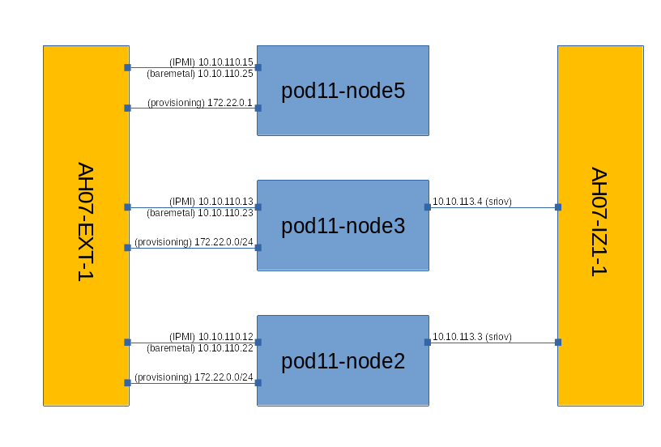
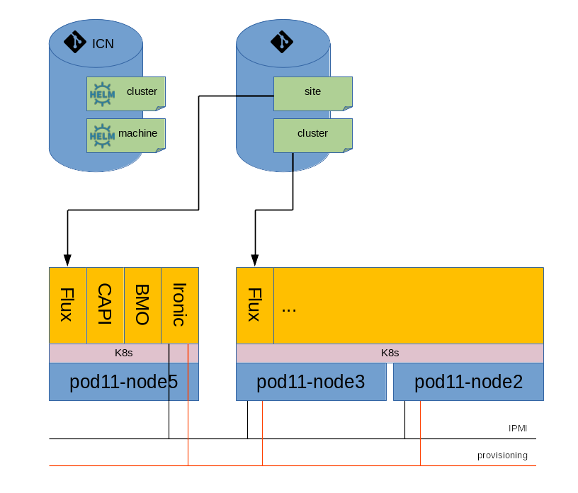

# Installation guide

## Hardware

### Overview

Due to the almost limitless number of possible hardware
configurations, this installation guide has chosen a concrete
configuration to use in the examples that follow.

> NOTE: The example configuration's BMC does not support Redfish
> virtual media, and therefore IPMI is used instead.  When supported
> by the BMC, it is recommended to use the more secure Redfish virtual
> media option as shown [Quick start guide](quick-start.md).

The configuration contains the following three machines.

<table id="orgf44d94a" border="2" cellspacing="0" cellpadding="6" rules="groups" frame="hsides">

<colgroup>
<col  class="org-left" />

<col  class="org-right" />

<col  class="org-left" />

<col  class="org-left" />

<col  class="org-left" />

<col  class="org-left" />

<col  class="org-left" />
</colgroup>
<thead>
<tr>
<th scope="col" class="org-left">Hostname</th>
<th scope="col" class="org-right">CPU Model</th>
<th scope="col" class="org-left">Memory</th>
<th scope="col" class="org-left">Storage</th>
<th scope="col" class="org-left">IPMI: IP/MAC, U/P</th>
<th scope="col" class="org-left">1GbE: NIC#, IP, MAC, VLAN, Network</th>
<th scope="col" class="org-left">10GbE: NIC#, IP, MAC, VLAN, Network</th>
</tr>
</thead>

<tbody>
<tr>
<td class="org-left">pod11-node5</td>
<td class="org-right">2xE5-2699</td>
<td class="org-left">64GB</td>
<td class="org-left">3TB (Sata)&lt;br/&gt;180 (SSD)</td>
<td class="org-left">IF0: 10.10.110.15 00:1e:67:fc:ff:18&lt;br/&gt;U/P: root/root</td>
<td class="org-left">IF0: 10.10.110.25 00:1e:67:fc:ff:16 VLAN 110&lt;br/&gt;IF1: 172.22.0.1 00:1e:67:fc:ff:17 VLAN 111</td>
<td class="org-left">&#xa0;</td>
</tr>

<tr>
<td class="org-left">pod11-node3</td>
<td class="org-right">2xE5-2699</td>
<td class="org-left">64GB</td>
<td class="org-left">3TB (Sata)&lt;br/&gt;180 (SSD)</td>
<td class="org-left">IF0: 10.10.110.13 00:1e:67:f1:5b:92&lt;br/&gt;U/P: root/root</td>
<td class="org-left">IF0: 10.10.110.23 00:1e:67:f1:5b:90 VLAN 110&lt;br/&gt;IF1: 172.22.0.0/24 00:1e:67:f1:5b:91 VLAN 111</td>
<td class="org-left">IF3: 10.10.113.4 00:1e:67:f8:69:81 VLAN 113</td>
</tr>

<tr>
<td class="org-left">pod11-node2</td>
<td class="org-right">2xE5-2699</td>
<td class="org-left">64GB</td>
<td class="org-left">3TB (Sata)&lt;br/&gt;180 (SSD)</td>
<td class="org-left">IF0: 10.10.110.12 00:1e:67:fe:f4:1b&lt;br/&gt;U/P: root/root</td>
<td class="org-left">IF0: 10.10.110.22 00:1e:67:fe:f4:19 VLAN 110&lt;br/&gt;IF1: 172.22.0.0/14 00:1e:67:fe:f4:1a VLAN 111</td>
<td class="org-left">IF3: 10.10.113.3 00:1e:67:f8:6a:41 VLAN 113</td>
</tr>
</tbody>
</table>

`pod11-node5` will be the Local Controller or *jump server*. The other
two machines will form a two-node K8s cluster.

Recommended hardware requirements are servers with 64GB Memory, 32
CPUs and SR-IOV network cards.

The machines are connected in the following topology.

There are three networks required by ICN:

-   The `baremetal` network, used as the control plane for K8s and for
    overlay networking.
-   The `provisioning` network, used during the infrastructure
    provisioning (OS installation) phase.
-   The `IPMI` network, also used during the infrastructure provisioning
    phase.

In this configuration, the IPMI and baremetal interfaces share the
same port and network. Care has been taken to ensure that the IP
addresses do not conflict between the two interfaces.

There is an additional network connected to a high-speed switch:

-   The `sriov` network, available for the application data plane.

### Configuration

#### Baseboard Management Controller (BMC) configuration

The BMC IP address should be statically assigned using the machine's
BMC tool or application.
    
To verify IPMI is configured correctly for each cluster machine, use
ipmitool:

    # ipmitool -I lanplus -H 10.10.110.13 -L ADMINISTRATOR -U root -R 7 -N 5 -P root power status
    Chassis Power is on

If the ipmitool output looks like the following, enable the *RMCP+
Cipher Suite3 Configuration* using the machine's BMC tool or application.

    # ipmitool -I lanplus -H 10.10.110.13 -L ADMINISTRATOR -U root -R 7 -N 5 -P root power status
    Error in open session response message : insufficient resources for session
    Error: Unable to establish IPMI v2 / RMCP+ session

If the ipmitool output looks like the following, enable *IPMI over lan*
using the machine's BMC tool or application.

    # ipmitool -I lan -H 10.10.110.13 -L ADMINISTRATOR -U root -R 7 -N 5 -P root power status
    Error: Unable to establish LAN session

Additional information on ipmitool may be found at [Configuring IPMI
under Linux using
ipmitool](https://www.thomas-krenn.com/en/wiki/Configuring_IPMI_under_Linux_using_ipmitool).

#### PXE Boot configuration

Each cluster machine must be configured to PXE boot from the interface
attached to the `provisioning` network.

One method of verifying PXE boot is configured correctly is to access
the remote console of the machine and observe the boot process. If
the machine is not attempting PXE boot or it is attempting to PXE boot
on the wrong interface, reboot the machine into the BIOS and select
the correct interface in the boot options.

Additional verification can be done on the jump server using the
tcpdump tool. The following command looks for DHCP or TFTP traffic
arriving on any interface. Replace `any` with the interface attached to
the provisioning network to verify end-to-end connectivity between the
jump server and cluster machine.

    # tcpdump -i any port 67 or port 68 or port 69

If tcpdump does not show any traffic, verify that the any switches are
configured properly to forward PXE boot requests (i.e. VLAN
configuration).

## Jump server

### Configure the jump server

The jump server is required to be pre-installed with an OS. ICN
supports Ubuntu 20.04.

Before provisioning the jump server, first edit `user_config.sh` to
provide the name of the interface connected to the provisioning
network.

    # ip --brief link show
    ...
    enp4s0f3         UP             00:1e:67:fc:ff:17 <BROADCAST,MULTICAST,UP,LOWER_UP>
    ...
    # cat user_config.sh
    #!/usr/bin/env bash
    export IRONIC_INTERFACE="enp4s0f3"

### Install the jump server components

    make jump_server

### Uninstallation

    make clean_jump_server

## Compute clusters

### Overview

Before proceeding with the configuration, a basic understanding of the
essential components used in ICN is required.

#### Flux

[Flux](https://fluxcd.io/) is a tool for implementing GitOps workflows where infrastructure
and application configuration is committed to source control and
continuously deployed in a K8s cluster.
    
The important Flux resources ICN uses are:
    
-   GitRepository, which describes where configuration data is committed
-   HelmRelease, which describes an installation of a Helm chart
-   Kustomization, which describes application of K8s resources
    customized with a kustomization file

#### Cluster API (CAPI)

[Cluster API](https://cluster-api.sigs.k8s.io/) provides declarative APIs and tooling for provisioning,
upgrading, and operating K8s clusters.
    
There are a number of important CAPI resources that ICN uses. To ease
deployment, ICN captures the resources into a Helm chart.

#### Bare Metal Operator (BMO)

Central to CAPI are infrastructure and bootstrap providers. There are
pluggable components for configuring the OS and K8s installation
respectively.
    
ICN uses the [Cluster API Provider Metal3 for Managed Bare Metal
Hardware](https://github.com/metal3-io/cluster-api-provider-metal3) for infrastructure provisioning, which in turn depends on the
[Metal3 Bare Metal Operator](https://github.com/metal3-io/baremetal-operator) to do the actual work. The Bare Metal
Operator uses [Ironic](https://ironicbaremetal.org/) to execute the low-level provisioning tasks.
    
Similar to the CAPI resources that ICN uses, ICN captures the Bare
Metal Operator resources it uses into a Helm chart.

### Configuration

> NOTE: To assist in the migration of R5 and earlier release's use from
> nodes.json and the Provisioning resource to the site YAML described
> below, a helper script is provided at tools/migration/tor6.sh.

#### Define the compute cluster

The first step in provisioning a site with ICN is to define the
desired day-0 configuration of the workload clusters.
    
A [configuration](https://gerrit.akraino.org/r/gitweb?p=icn.git;a=tree;f=deploy/site/cluster-icn) containing all supported ICN components is available
in the ICN repository. End-users may use this as a base and add or
remove components as desired. Each YAML file in this configuration is
one of the Flux resources described in the overview: GitRepository,
HelmRelease, or Kustomization.

#### Define the site

A site definition is composed of BMO and CAPI resources, describing
machines and clusters respectively. These resources are captured into
the ICN machine and cluster Helm charts. Defining the site is
therefore a matter of specifying the values needed by the charts.
    
##### Site-specific Considerations
    
Documentation for the machine chart may be found in its [values.yaml](https://gerrit.akraino.org/r/gitweb?p=icn.git;a=blob;f=deploy/machine/values.yaml),
and documentation for the cluster chart may be found in its
[values.yaml](https://gerrit.akraino.org/r/gitweb?p=icn.git;a=blob;f=deploy/cluster/values.yaml). Please review those for more information; what follows
is some site-specific considerations to be aware of.
        
Note that there are a large number of ways to configure machines and
especially clusters; for large scale deployments it may make sense to
create custom charts to eliminate duplication in the values
specification.
        
###### Control plane endpoint
        
The K8s control plane endpoint address must be provided to the cluster
chart.
            
For a highly-available control plane, this would typically be a
load-balanced virtual IP address. Configuration of an external load
balancer is out of scope for this document. The chart also provides
another mechanism to accomplish this using the VRRP protocol to assign
the control plane endpoint among the selected control plane nodes; see
the `keepalived` dictionary in the cluster chart values.
            
For a single control plane node with a static IP address, some care
must be taken to ensure that CAPI chooses the correct machine to
provision as the control plane node. To do this, add a label to the
`machineLabels` dictionary in the machine chart and specify a K8s match
expression in the `controlPlaneHostSelector` dictionary of the cluster
chart. Once done, the IP address of the labeled and selected machine
can be used as the control plane endpoint address.
        
###### Static or dynamic baremetal network IPAM
        
The cluster and machine charts support either static or dynamic IPAM
in the baremetal network.
            
Dynamic IPAM is configured by specifying the `networks` dictionary in
the cluster chart. At least two entries must be included, the
`baremetal` and `provisioning` networks. Under each entry, provide the
predictable network interface name as the value of `interface` key.
            
Note that this is in the cluster chart and therefore is in the form of
a template for each machine used in the cluster. If the machines are
sufficiently different such that the same interface name is not used
on each machine, then the static approach below must be used instead.
            
Static IPAM is configured by specifying the `networks` dictionary in the
machine chart. At least two entries must be included, the `baremetal`
and `provisioning` networks. From the chart example values:
            
    networks:
      baremetal:
        macAddress: 00:1e:67:fe:f4:19
        # type is either ipv4 or ipv4_dhcp
        type: ipv4
        # ipAddress is only valid for type ipv4
        ipAddress: 10.10.110.21/24
        # gateway is only valid for type ipv4
        gateway: 10.10.110.1
        # nameservers is an array of DNS servers; only valid for type ipv4
        nameservers: ["8.8.8.8"]
      provisioning:
        macAddress: 00:1e:67:fe:f4:1a
        type: ipv4_dhcp
            
The provisioning network must always be type `ipv4_dhcp`.
            
In either the static or dynamic case additional networks may be
included, however the static assignment option for an individual
network exists only when the machine chart approach is used.
    
##### Prerequisites
    
The first thing done is to create a `site.yaml` file containing a
Namespace to hold the site resources and a GitRepository pointing to
the ICN repository where the machine and cluster Helm charts are
located.
        
Note that when definining multiple sites it is only necessary to apply
the Namespace and GitRepository once on the jump server managing the
sites.
        
    ---
    apiVersion: v1
    kind: Namespace
    metadata:
      name: metal3
    ---
    apiVersion: source.toolkit.fluxcd.io/v1beta1
    kind: GitRepository
    metadata:
      name: icn
      namespace: metal3
    spec:
      gitImplementation: go-git
      interval: 1m0s
      ref:
        branch: master
      timeout: 20s
      url: https://gerrit.akraino.org/r/icn
    
##### Define a machine
    
Important values in machine definition include:
        
-   **machineName:** the host name of the machine
-   **bmcAddress, bmcUsername, bmcPassword:** the bare metal controller
    (e.g. IPMI) access values
        
Capture each machine's values into a HelmRelease in the site YAML:
        
    ---
    apiVersion: helm.toolkit.fluxcd.io/v2beta1
    kind: HelmRelease
    metadata:
      name: pod11-node2
      namespace: metal3
    spec:
      interval: 5m
      chart:
        spec:
          chart: deploy/machine
          sourceRef:
            kind: GitRepository
            name: icn
          interval: 1m
      values:
        machineName: pod11-node2
        machineLabels:
          machine: pod11-node2
        bmcAddress: ipmi://10.10.110.12
        bmcUsername: root
        bmcPassword: root
        networks:
          baremetal:
            macAddress: 00:1e:67:fe:f4:19
            type: ipv4
            ipAddress: 10.10.110.22/24
            gateway: 10.10.110.1
            nameservers:
              - 8.8.8.8
          provisioning:
            macAddress: 00:1e:67:fe:f4:1a
            type: ipv4_dhcp
          private:
            macAddress: 00:1e:67:f8:6a:40
            type: ipv4
            ipAddress: 10.10.112.3/24
          storage:
            macAddress: 00:1e:67:f8:6a:41
            type: ipv4
            ipAddress: 10.10.113.3/24
    
##### Define a cluster
    
Important values in cluster definition include:
        
-   **clusterName:** the name of the cluster
-   **numControlPlaneMachines:** the number of control plane nodes
-   **numWorkerMachines:** the number of worker nodes
-   **controlPlaneEndpoint:** see [Site-specific Considerations](#site-specific-considerations) above
-   **userData:** dictionary containing default username, password, and
    authorized SSH key
-   **flux:** dictionary containing location of day-0 configuration of
    cluster; see [Define the compute cluster](#define-the-compute-cluster) above
        
Capture each cluster's values into a HelmRelease in the site YAML:
        
    ---
    apiVersion: helm.toolkit.fluxcd.io/v2beta1
    kind: HelmRelease
    metadata:
      name: cluster-icn
      namespace: metal3
    spec:
      interval: 5m
      chart:
        spec:
          chart: deploy/cluster
          sourceRef:
            kind: GitRepository
            name: icn
          interval: 1m
      values:
        clusterName: icn
        clusterLabels:
          site: pod11
        controlPlaneEndpoint: 10.10.110.23
        controlPlaneHostSelector:
          matchLabels:
            machine: pod11-node3
        workersHostSelector:
          matchLabels:
            machine: pod11-node2
        userData:
          hashedPassword: $6$rounds=10000$PJLOBdyTv23pNp$9RpaAOcibbXUMvgJScKK2JRQioXW4XAVFMRKqgCB5jC4QmtAdbA70DU2jTcpAd6pRdEZIaWFjLCNQMBmiiL40.
          sshAuthorizedKey: ssh-rsa AAAAB3NzaC1yc2EAAAADAQABAAABAQCwLj/ekRDjp354W8kcGLagjudjTBZO8qBffJ4mNb01EJueUbLvM8EwCv2zu9lFKHD+nGkc1fkB3RyCn5OqzQDTAIpp82nOHXtrbKAZPg2ob8BlfVAz34h5r1bG78lnMH1xk7HKNbf73h9yzUEKiyrd8DlhJcJrsOZTPuTdRrIm7jxScDJpHFjy8tGISNMcnBGrNS9ukaRLK+PiEfDpuRtw/gOEf58NXgu38BcNm4tYfacHYuZFUbNCqj9gKi3btZawgybICcqrNqF36E/XXMfCS1qxZ7j9xfKjxWFgD9gW/HkRtV6K11NZFEvaYBFBA9S/GhLtk9aY+EsztABthE0J root@pod11-node5
        flux:
          url: https://gerrit.akraino.org/r/icn
          branch: master
          path: ./deploy/site/cluster-icn
    
##### Encrypt secrets in site definition
    
This step is optional, but recommended to protect sensitive
information stored in the site definition. The site script is
configured to protect the `bmcPassword` and `hashedPassword` values.

Use an existing GPG key pair or create a new one, then encrypt the
secrets contained in the site YAML using site.sh. The public key and
SOPS configuration is created in the site YAML directory; these may be
used to encrypt (but not decrypt) future secrets.
        
    # ./deploy/site/site.sh create-gpg-key site-secrets-key
    # ./deploy/site/site.sh sops-encrypt-site site.yaml site-secrets-key
    
##### Example site definitions
    
Refer to the [pod11 site.yaml](https://gerrit.akraino.org/r/gitweb?p=icn.git;a=blob;f=deploy/site/pod11/site.yaml) and the [vm site.yaml](https://gerrit.akraino.org/r/gitweb?p=icn.git;a=blob;f=deploy/site/vm/site.yaml) for complete
examples of site definitions for a static and dynamic baremetal
network respectively. These site definitions are for simple two
machine clusters used in ICN testing.

#### Inform the Flux controllers of the site definition

The final step is inform the jump server Flux controllers of the site
definition be creating three resources:
    
-   a GitRepository containing the location where the site definition is
    committed
-   a Secret holding the GPG private key used to encrypt the secrets in
    the site definition
-   a Kustomization referencing the GitRepository, Secret, and path in
    the repository where the site definition is located
    
This may be done with the help of the `site.sh` script:
    
    # ./deploy/site/site.sh flux-create-site URL BRANCH PATH KEY_NAME

### Deployment

#### Monitoring progress

The overall status of the cluster deployment can be monitored with
`clusterctl`.
    
    # clusterctl -n metal3 describe cluster icn
    NAME                                                                READY  SEVERITY  REASON                           SINCE  MESSAGE
    /icn                                                                False  Warning   ScalingUp                        4m14s  Scaling up control plane to 1 replicas (actual 0)
    ├─ClusterInfrastructure - Metal3Cluster/icn
    ├─ControlPlane - KubeadmControlPlane/icn                            False  Warning   ScalingUp                        4m14s  Scaling up control plane to 1 replicas (actual 0)
    │ └─Machine/icn-9sp7z                                               False  Info      WaitingForInfrastructure         4m17s  1 of 2 completed
    │   └─MachineInfrastructure - Metal3Machine/icn-controlplane-khtsk
    └─Workers
      └─MachineDeployment/icn                                           False  Warning   WaitingForAvailableMachines      4m49s  Minimum availability requires 1 replicas, current 0 available
        └─Machine/icn-6b8dfc7f6f-tmgv7                                  False  Info      WaitingForInfrastructure         4m49s  0 of 2 completed
          ├─BootstrapConfig - KubeadmConfig/icn-workers-79pl9           False  Info      WaitingForControlPlaneAvailable  4m19s
          └─MachineInfrastructure - Metal3Machine/icn-workers-m7vb8
    
The status of OS provisioning can be monitored by inspecting the
`BareMetalHost` resources.
    
    # kubectl -n metal3 get bmh
    NAME          STATE        CONSUMER   ONLINE   ERROR   AGE
    pod11-node2   inspecting              true             5m15s
    pod11-node3   inspecting              true             5m14s
    
Once the OS is installed, the status of K8s provisioning can be
monitored by logging into the machine using the credentials from the
`userData` section of the site values and inspecting the cloud-init
logs.
    
    root@pod11-node2:~# tail -f /var/log/cloud-init-output.log
    ...
    Cloud-init v. 21.4-0ubuntu1~20.04.1 running 'modules:final' at Wed, 05 Jan 2022 01:34:41 +0000. Up 131.66 seconds.
    Cloud-init v. 21.4-0ubuntu1~20.04.1 finished at Wed, 05 Jan 2022 01:34:41 +0000. Datasource DataSourceConfigDrive [net,ver=2][source=/dev/sda2].  Up 132.02 seconds
    
Once the cluster's control plane is ready, its kubeconfig can be
obtained with `clusterctl` and the status of the cluster can be
monitored with `kubectl`.
    
    # clusterctl -n metal3 get kubeconfig icn >icn-admin.conf
    # kubectl --kubeconfig=icn-admin.conf get pods -A
    NAMESPACE     NAME                                                 READY   STATUS    RESTARTS   AGE
    emco          db-emco-mongo-0                                      1/1     Running   0          15h
    emco          emco-etcd-0                                          1/1     Running   0          15h
    ...

#### Examining the deployment process

The deployment resources can be examined with the kubectl and helm
tools.  The below example provides pointers to the resources in the
jump server.
    
    # kubectl -n flux-system get GitRepository
    NAME         URL                                READY   STATUS                                                              AGE
    icn-master   https://gerrit.akraino.org/r/icn   True    Fetched revision: master/0e93643e74f26bfc062a81c2f05ad947550f8d50   16h
        
    # kubectl -n flux-system get Kustomization
    NAME                    READY   STATUS                                                              AGE
    icn-master-site-pod11   True    Applied revision: master/0e93643e74f26bfc062a81c2f05ad947550f8d50   7m4s
        
    # kubectl -n metal3 get GitRepository
    NAME   URL                                READY   STATUS                                                              AGE
    icn    https://gerrit.akraino.org/r/icn   True    Fetched revision: master/0e93643e74f26bfc062a81c2f05ad947550f8d50   7m22s
        
    # kubectl -n metal3 get HelmRelease
    NAME          READY   STATUS                             AGE
    cluster-icn   True    Release reconciliation succeeded   7m54s
    pod11-node2   True    Release reconciliation succeeded   7m54s
    pod11-node3   True    Release reconciliation succeeded   7m54s
        
    # kubectl -n metal3 get HelmChart
    NAME                 CHART            VERSION   SOURCE KIND     SOURCE NAME   READY   STATUS                                 AGE
    metal3-cluster-icn   deploy/cluster   *         GitRepository   icn           True    Fetched and packaged revision: 0.1.0   8m9s
    metal3-pod11-node2   deploy/machine   *         GitRepository   icn           True    Fetched and packaged revision: 0.1.0   8m9s
    metal3-pod11-node3   deploy/machine   *         GitRepository   icn           True    Fetched and packaged revision: 0.1.0   8m9s
    
    # helm -n metal3 ls
    NAME            NAMESPACE       REVISION        UPDATED                                 STATUS          CHART           APP VERSION
    cluster-icn     metal3          2               2022-01-05 01:03:51.075860871 +0000 UTC deployed        cluster-0.1.0
    pod11-node2     metal3          2               2022-01-05 01:03:49.365432 +0000 UTC    deployed        machine-0.1.0
    pod11-node3     metal3          2               2022-01-05 01:03:49.463726617 +0000 UTC deployed        machine-0.1.0
    
    # helm -n metal3 get values --all cluster-icn
    COMPUTED VALUES:
    clusterLabels:
      provider: icn
      site: pod11
    clusterName: icn
    cni: flannel
    containerRuntime: containerd
    containerdVersion: 1.4.11-1
    controlPlaneEndpoint: 10.10.110.23
    controlPlaneHostSelector:
      matchLabels:
        machine: pod11-node3
    controlPlanePrefix: 24
    dockerVersion: 5:20.10.10~3-0~ubuntu-focal
    flux:
      branch: master
      path: ./deploy/site/cluster-icn
      repositoryName: icn
      url: https://gerrit.akraino.org/r/icn
    imageName: focal-server-cloudimg-amd64.img
    k8sVersion: v1.21.6
    kubeVersion: 1.21.6-00
    numControlPlaneMachines: 1
    numWorkerMachines: 1
    podCidr: 10.244.64.0/18
    userData:
      hashedPassword: $6$rounds=10000$bhRsNADLl$BzCcBaQ7Tle9AizUHcMKN2fygyPMqBebOuvhApI8B.pELWyFUaAWRasPOz.5Gf9bvCihakRnBTwsi217n2qQs1
      name: ubuntu
      sshAuthorizedKey: ssh-rsa AAAAB3NzaC1yc2EAAAADAQABAAABAQCwLj/ekRDjp354W8kcGLagjudjTBZO8qBffJ4mNb01EJueUbLvM8EwCv2zu9lFKHD+nGkc1fkB3RyCn5OqzQDTAIpp82nOHXtrbKAZPg2ob8BlfVAz34h5r1bG78lnMH1xk7HKNbf73h9yzUEKiyrd8DlhJcJrsOZTPuTdRrIm7jxScDJpHFjy8tGISNMcnBGrNS9ukaRLK+PiEfDpuRtw/gOEf58NXgu38BcNm4tYfacHYuZFUbNCqj9gKi3btZawgybICcqrNqF36E/XXMfCS1qxZ7j9xfKjxWFgD9gW/HkRtV6K11NZFEvaYBFBA9S/GhLtk9aY+EsztABthE0J root@pod11-node5
    workersHostSelector:
      matchLabels:
        machine: pod11-node2
        
    # helm -n metal3 get values --all pod11-node2
    COMPUTED VALUES:
    bmcAddress: ipmi://10.10.110.12
    bmcPassword: root
    bmcUsername: root
    machineLabels:
      machine: pod11-node2
    machineName: pod11-node2
    networks:
      baremetal:
        gateway: 10.10.110.1
        ipAddress: 10.10.110.22/24
        macAddress: 00:1e:67:fe:f4:19
        nameservers:
        - 8.8.8.8
        type: ipv4
      provisioning:
        macAddress: 00:1e:67:fe:f4:1a
        type: ipv4_dhcp
      sriov:
        ipAddress: 10.10.113.3/24
        macAddress: 00:1e:67:f8:6a:41
        type: ipv4
    
    # helm -n metal3 get values --all pod11-node3
    COMPUTED VALUES:
    bmcAddress: ipmi://10.10.110.13
    bmcPassword: root
    bmcUsername: root
    machineLabels:
      machine: pod11-node3
    machineName: pod11-node3
    networks:
      baremetal:
        gateway: 10.10.110.1
        ipAddress: 10.10.110.23/24
        macAddress: 00:1e:67:f1:5b:90
        nameservers:
        - 8.8.8.8
        type: ipv4
      provisioning:
        macAddress: 00:1e:67:f1:5b:91
        type: ipv4_dhcp
      sriov:
        ipAddress: 10.10.113.4/24
        macAddress: 00:1e:67:f8:69:81
        type: ipv4

Once the workload cluster is ready, the deployment resources may be
examined similarly.

    root@jump:/icn# clusterctl -n metal3 get kubeconfig icn >icn-admin.conf
    root@pod11-node5:# kubectl --kubeconfig=icn-admin.conf get GitRepository -A
    NAMESPACE     NAME   URL                                        READY   STATUS                                                                         AGE
    emco          emco   https://github.com/open-ness/EMCO          True    Fetched revision: openness-21.03.06/18ec480f755119d54aa42c1bc3bd248dfd477165   16h
    flux-system   icn    https://gerrit.akraino.org/r/icn           True    Fetched revision: master/0e93643e74f26bfc062a81c2f05ad947550f8d50              16h
    kud           kud    https://gerrit.onap.org/r/multicloud/k8s   True    Fetched revision: master/8157bf63753839ce4e9006978816fad3f63ca2de              16h
    
    root@pod11-node5:# kubectl --kubeconfig=icn-admin.conf get Kustomization -A
    NAMESPACE     NAME            READY   STATUS                                                              AGE
    flux-system   icn-flux-sync   True    Applied revision: master/0e93643e74f26bfc062a81c2f05ad947550f8d50   16h
    flux-system   kata            True    Applied revision: master/0e93643e74f26bfc062a81c2f05ad947550f8d50   16h
    
    root@pod11-node5:# kubectl --kubeconfig=icn-admin.conf get HelmRelease -A
    NAMESPACE   NAME                     READY   STATUS                                                                             AGE
    emco        db                       True    Release reconciliation succeeded                                                   16h
    emco        monitor                  True    Release reconciliation succeeded                                                   16h
    emco        podsecurity              True    Release reconciliation succeeded                                                   16h
    emco        services                 True    Release reconciliation succeeded                                                   16h
    emco        tools                    True    Release reconciliation succeeded                                                   16h
    kud         cdi                      True    Release reconciliation succeeded                                                   16h
    kud         cdi-operator             True    Release reconciliation succeeded                                                   16h
    kud         cpu-manager              True    Release reconciliation succeeded                                                   16h
    kud         kubevirt                 True    Release reconciliation succeeded                                                   16h
    kud         kubevirt-operator        True    Release reconciliation succeeded                                                   16h
    kud         multus-cni               True    Release reconciliation succeeded                                                   16h
    kud         node-feature-discovery   True    Release reconciliation succeeded                                                   16h
    kud         ovn4nfv                  True    Release reconciliation succeeded                                                   16h
    kud         ovn4nfv-network          True    Release reconciliation succeeded                                                   16h
    kud         podsecurity              True    Release reconciliation succeeded                                                   16h
    kud         qat-device-plugin        True    Release reconciliation succeeded                                                   16h
    kud         sriov-network            True    Release reconciliation succeeded                                                   16h
    kud         sriov-network-operator   True    Release reconciliation succeeded                                                   16h
    
    root@pod11-node5:# kubectl --kubeconfig=icn-admin.conf get HelmChart -A
    NAMESPACE     NAME                         CHART                                              VERSION   SOURCE KIND     SOURCE NAME   READY   STATUS                                 AGE
    emco          emco-db                      deployments/helm/emcoOpenNESS/emco-db              *         GitRepository   emco          True    Fetched and packaged revision: 0.1.0   16h
    emco          emco-monitor                 deployments/helm/monitor                           *         GitRepository   emco          True    Fetched and packaged revision: 0.1.0   16h
    emco          emco-services                deployments/helm/emcoOpenNESS/emco-services        *         GitRepository   emco          True    Fetched and packaged revision: 0.1.0   16h
    emco          emco-tools                   deployments/helm/emcoOpenNESS/emco-tools           *         GitRepository   emco          True    Fetched and packaged revision: 0.1.0   16h
    flux-system   emco-podsecurity             deploy/podsecurity                                 *         GitRepository   icn           True    Fetched and packaged revision: 0.1.0   16h
    flux-system   kud-podsecurity              deploy/podsecurity                                 *         GitRepository   icn           True    Fetched and packaged revision: 0.1.0   16h
    kud           kud-cdi                      kud/deployment_infra/helm/cdi                      *         GitRepository   kud           True    Fetched and packaged revision: 0.1.0   16h
    kud           kud-cdi-operator             kud/deployment_infra/helm/cdi-operator             *         GitRepository   kud           True    Fetched and packaged revision: 0.1.1   16h
    kud           kud-cpu-manager              kud/deployment_infra/helm/cpu-manager              *         GitRepository   kud           True    Fetched and packaged revision: 0.1.0   16h
    kud           kud-kubevirt                 kud/deployment_infra/helm/kubevirt                 *         GitRepository   kud           True    Fetched and packaged revision: 0.1.0   16h
    kud           kud-kubevirt-operator        kud/deployment_infra/helm/kubevirt-operator        *         GitRepository   kud           True    Fetched and packaged revision: 0.1.0   16h
    kud           kud-multus-cni               kud/deployment_infra/helm/multus-cni               *         GitRepository   kud           True    Fetched and packaged revision: 0.1.0   16h
    kud           kud-node-feature-discovery   kud/deployment_infra/helm/node-feature-discovery   *         GitRepository   kud           True    Fetched and packaged revision: 0.1.0   16h
    kud           kud-ovn4nfv                  kud/deployment_infra/helm/ovn4nfv                  *         GitRepository   kud           True    Fetched and packaged revision: 0.1.0   16h
    kud           kud-ovn4nfv-network          kud/deployment_infra/helm/ovn4nfv-network          *         GitRepository   kud           True    Fetched and packaged revision: 0.1.0   16h
    kud           kud-qat-device-plugin        kud/deployment_infra/helm/qat-device-plugin        *         GitRepository   kud           True    Fetched and packaged revision: 0.1.0   16h
    kud           kud-sriov-network            kud/deployment_infra/helm/sriov-network            *         GitRepository   kud           True    Fetched and packaged revision: 0.1.0   16h
    kud           kud-sriov-network-operator   kud/deployment_infra/helm/sriov-network-operator   *         GitRepository   kud           True    Fetched and packaged revision: 0.1.0   16h
    
    root@pod11-node5:# helm --kubeconfig=icn-admin.conf ls -A
    NAME                    NAMESPACE       REVISION        UPDATED                                 STATUS          CHART                                                                                                                       APP VERSION
    cdi                     kud             2               2022-01-05 01:54:28.39195226 +0000 UTC  deployed        cdi-0.1.0                                                                                                                   v1.34.1
    cdi-operator            kud             2               2022-01-05 01:54:04.904465491 +0000 UTC deployed        cdi-operator-0.1.1                                                                                                          v1.34.1
    cpu-manager             kud             2               2022-01-05 01:54:01.911819055 +0000 UTC deployed        cpu-manager-0.1.0                                                                                                           v1.4.1-no-taint
    db                      emco            2               2022-01-05 01:53:36.096690949 +0000 UTC deployed        emco-db-0.1.0                                                                                                                
    kubevirt                kud             2               2022-01-05 01:54:12.563840437 +0000 UTC deployed        kubevirt-0.1.0                                                                                                              v0.41.0
    kubevirt-operator       kud             2               2022-01-05 01:53:59.190388299 +0000 UTC deployed        kubevirt-operator-0.1.0                                                                                                     v0.41.0
    monitor                 emco            2               2022-01-05 01:53:36.085180458 +0000 UTC deployed        monitor-0.1.0                                                                                                               1.16.0
    multus-cni              kud             2               2022-01-05 01:54:03.494462704 +0000 UTC deployed        multus-cni-0.1.0                                                                                                            v3.7
    node-feature-discovery  kud             2               2022-01-05 01:53:58.489616047 +0000 UTC deployed        node-feature-discovery-0.1.0                                                                                                v0.7.0
    ovn4nfv                 kud             2               2022-01-05 01:54:07.488105774 +0000 UTC deployed        ovn4nfv-0.1.0                                                                                                               v3.0.0
    ovn4nfv-network         kud             2               2022-01-05 01:54:31.79127155 +0000 UTC  deployed        ovn4nfv-network-0.1.0                                                                                                       v2.2.0
    podsecurity             kud             2               2022-01-05 01:53:37.400019369 +0000 UTC deployed        podsecurity-0.1.0                                                                                                            
    podsecurity             emco            2               2022-01-05 01:53:35.993351972 +0000 UTC deployed        podsecurity-0.1.0                                                                                                            
    qat-device-plugin       kud             2               2022-01-05 01:54:03.598022943 +0000 UTC deployed        qat-device-plugin-0.1.0                                                                                                     0.19.0-kerneldrv
    sriov-network           kud             2               2022-01-05 01:54:31.695963579 +0000 UTC deployed        sriov-network-0.1.0                                                                                                         4.8.0
    sriov-network-operator  kud             2               2022-01-05 01:54:07.787596951 +0000 UTC deployed        sriov-network-operator-0.1.0                                                                                                4.8.0
    tools                   emco            2               2022-01-05 01:53:58.317119097 +0000 UTC deployed        emco-tools-0.1.0
        
    root@pod11-node5:# kubectl --kubeconfig=icn-admin.conf get pods -A -o wide
    NAMESPACE     NAME                                                 READY   STATUS    RESTARTS   AGE   IP             NODE          NOMINATED NODE   READINESS GATES
    emco          db-emco-mongo-0                                      1/1     Running   0          16h   10.244.65.53   pod11-node2   <none>           <none>
    emco          emco-etcd-0                                          1/1     Running   0          16h   10.244.65.57   pod11-node2   <none>           <none>
    emco          monitor-monitor-74649c5c64-dxhfn                     1/1     Running   0          16h   10.244.65.65   pod11-node2   <none>           <none>
    emco          services-clm-7ff876dfc-vgncs                         1/1     Running   3          16h   10.244.65.58   pod11-node2   <none>           <none>
    ...

### Verification

Basic self-tests of Kata, EMCO, and the other addons may be performed
with the `kata.sh` and `addons.sh` test scripts once the workload cluster
is ready.

    root@pod11-node5:# CLUSTER_NAME=icn ./deploy/kata/kata.sh test
    root@pod11-node5:# CLUSTER_NAME=icn ./deploy/addons/addons.sh test

### Uninstallation

To destroy the workload cluster and deprovision its machines, it is
only necessary to delete the site Kustomization.  Uninstallation
progress can be monitored similar to deployment with `clusterctl`,
examining the `BareMetalHost` resources, etc.

    root@pod11-node5:# kubectl -n flux-system delete Kustomization icn-master-site-pod11

