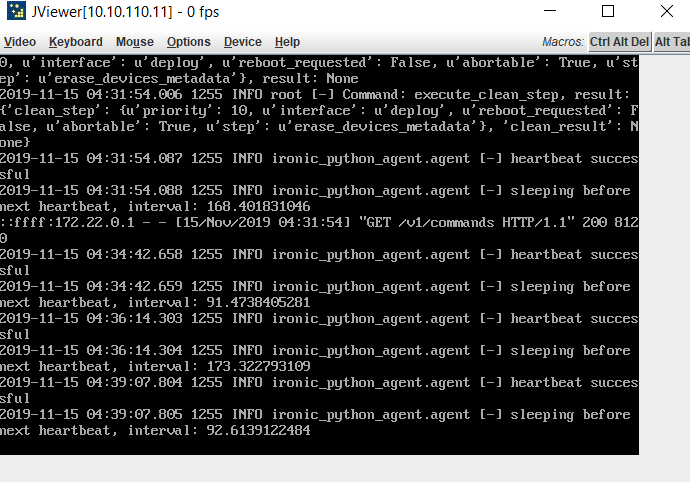

# Troubleshooting

## Where are the logs?

In addition to the monitoring and examining instructions in the
[Deployment](installation-guide.md#deployment) section of the
installation guide, ICN records its execution in various log files.
These logs can be found in the 'logs' subdirectory of the component,
for example 'deploy/ironic/logs'.

The logs of the Bare Metal Operator, Cluster API, and Flux controllers
can be examined using standard K8s tools.

## Early provisioning fails

First confirm that the BMC and PXE Boot configuration are correct as
described in the [Configuration](installation-guide.md#configuration)
section of the installation guide.

It is also recommended to enable the KVM console in the machine using
Raritan console or Intel web BMC console to observe early boot output
during provisioning.

  

Examining the BareMetalHost resource of the failing machine and the
logs of Bare Metal Operator and Ironic Pods may also provide a
description of why the provisioning is failing.

### openstack baremetal

In rare cases, the Ironic and Bare Metal Operator information may get
out of sync. In this case, using the 'openstack baremetal' tool can be
used to delete the stale information.

The general procedure (shown on the jump server) is:

- Locate UUID of active node.

      # kubectl -n metal3 get bmh -o json | jq '.items[]|.status.provisioning.ID'
      "99f64101-04f3-47bf-89bd-ef374097fcdc"

- Examine ironic information for stale node and port values.

      # OS_TOKEN=fake-token OS_URL=http://localhost:6385/ openstack baremetal node list
      +--------------------------------------+-------------+--------------------------------------+-------------+--------------------+-------------+
      | UUID                                 | Name        | Instance UUID                        | Power State | Provisioning State | Maintenance |
      +--------------------------------------+-------------+--------------------------------------+-------------+--------------------+-------------+
      | 0ec36f3b-80d1-41e6-949a-9ba40a87f625 | None        | None                                 | None        | enroll             | False       |
      | 99f64101-04f3-47bf-89bd-ef374097fcdc | pod11-node3 | 6e16529d-a1a4-450c-8052-46c82c87ca7b | power on    | manageable         | False       |
      +--------------------------------------+-------------+--------------------------------------+-------------+--------------------+-------------+
      # OS_TOKEN=fake-token OS_URL=http://localhost:6385/ openstack baremetal port list
      +--------------------------------------+-------------------+
      | UUID                                 | Address           |
      +--------------------------------------+-------------------+
      | c65b1324-2cdd-44d0-8d25-9372068add02 | 00:1e:67:f1:5b:91 |
      +--------------------------------------+-------------------+

- Delete the stale node and port.

      # OS_TOKEN=fake-token OS_URL=http://localhost:6385/ openstack baremetal node delete 0ec36f3b-80d1-41e6-949a-9ba40a87f625
      Deleted node 0ec36f3b-80d1-41e6-949a-9ba40a87f625
      # OS_TOKEN=fake-token OS_URL=http://localhost:6385/ openstack baremetal port delete c65b1324-2cdd-44d0-8d25-9372068add02
      Deleted port c65b1324-2cdd-44d0-8d25-9372068add02

- Create a new port.

      # OS_TOKEN=fake-token OS_URL=http://localhost:6385/ openstack baremetal port create --node 99f64101-04f3-47bf-89bd-ef374097fcdc 00:1e:67:f1:5b:91
      +-----------------------+--------------------------------------+
      | Field                 | Value                                |
      +-----------------------+--------------------------------------+
      | address               | 00:1e:67:f1:5b:91                    |
      | created_at            | 2021-04-27T22:24:08+00:00            |
      | extra                 | {}                                   |
      | internal_info         | {}                                   |
      | local_link_connection | {}                                   |
      | node_uuid             | 99f64101-04f3-47bf-89bd-ef374097fcdc |
      | physical_network      | None                                 |
      | portgroup_uuid        | None                                 |
      | pxe_enabled           | True                                 |
      | updated_at            | None                                 |
      | uuid                  | 93366f0a-aa12-4815-b524-b95839bfa05d |
      +-----------------------+--------------------------------------+

## Pod deployment fails due to Docker rate limits

If a Pod fails to start and the Pod status (`kubectl describe pod
...`) shows that the Docker pull rate limit has been reached, it is
possible to point ICN to a [Docker registry
mirror](https://docs.docker.com/registry/recipes/mirror/).

To enable the mirror on the jump server set `DOCKER_REGISTRY_MIRROR`
in `user_config.sh` before installing the jump server or following the
Docker's
[instructions](https://docs.docker.com/registry/recipes/mirror/#configure-the-docker-daemon)
to configure the daemon.

To enable the mirror in the provisioned cluster, set the
`dockerRegistryMirrors` value of the cluster chart.

## Helm release stuck in 'pending-install'

If the HelmRelease status for a chart in the workload cluster shows
that an install or upgrade is pending and e.g. no Pods are being
created, it is possible the Helm controller was restarted during
install of the HelmRelease.

The fix is to remove the Helm Secret of the failing release.  After
this, Flux will complete reconcilation succesfully.

     kubectl --kubeconfig=icn-admin.conf -n emco delete secret sh.helm.release.v1.db.v1

## No change in BareMetalHost state

Provisioning can take a fair amount of time, refer to [Monitoring
progress](installation-guide.md#monitoring-progress) to see where the
process is.
